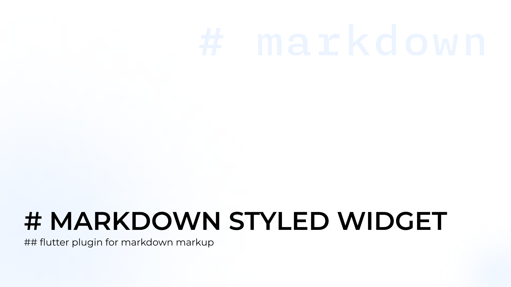
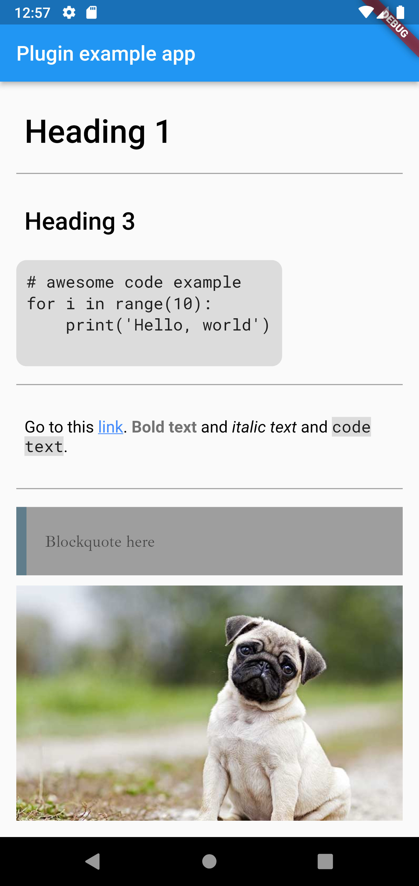
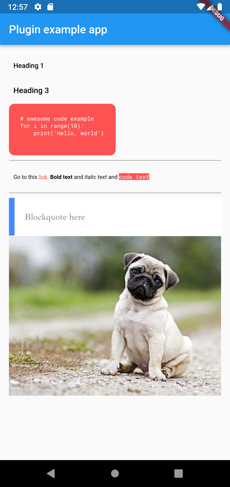

# markdown_styled_widget

[](https://pub.dev/packages/markdown_styled_widget)



| Default example | Customization example |
| --- | --- |
|  |  |

## Available markdown features

* headings from 1 to 6 level
* multiline and inline code
* bold and italic text
* links
* pictures
* blockqutes
* separate lines

## Getting started

In your pubspec.yaml

```
dependencies:
  markdown_styled_widget: ^0.0.1
```

```dart
import 'package:markdown_styled_widget/UI/markdown_styled_widget.dart';
```

### Basic usage

```dart
MarkdownStyledWidget(text);
```

### Custom usage

```dart
MarkdownStyledWidget(text,
  style: MarkdownStyledWidgetStyles(
   // describe styles here
  ),
)
```

## Available styles

There are available parameters for `MarkdownStyledWidgetStyles` class.

| Property | Type | Default value | Description | 
| --- | --- | --- | --- |
| `fontSize` | `double` | `16` | Default size of text |
| `defaultFont` | `String` | `'Roboto'` | Default font family for text |
| `defaultWeight` | `FontWeight` | `normal` | Default weight for text |
| `defaultForeground` | `Color` | `black` | Default text color |
| `boldWeight` | `FontWeight` | `bold` | Weight for bold text |
| `boldForeground` | `Color` | `black54` | Color for bold text |
| `linkForeground` | `Color` | `blueAccent` | Color for links view |
| `blockquoteFont` | `String` | `'IbarraRealNova'` | Font family for blockquotes |
| `blockquoteSize` | `double` | `16` | Font size for blockquotes |
| `blockquoteBackground` | `Color` | `grey` | Background color for blockquotes |
| `blockquoteForeground` | `Color` | `black54` | Text color for blockquotes |
| `blockquoteBorderColor` | `Color` | `blueGrey` | Color of left border for blockquotes |
| `blockquoteBorderSize` | `double` | `10` | Width of left border for blockquotes |
| `blockquotePadding` | `double` | `10` | Padding size for blockquotes |
| `codeBackground` | `Color` | `black12` | Background color for code statements |
| `codePadding` | `double` | `10` | Padding size for code statements |
| `codeBorderRadius` | `double` | `10` | Border radius for multiline code statements |
| `codeForeground` | `Color` | `black87` | Text color for code statements |
| `codeFont` | `String` | `'RobotoMono'` | Font family for code statements |
| `codeWeight` | `FontWeight` | `normal` | Font weight for code statements |
| `heading1Size` | `double` | `32` | Font size for level 1 heading |
| `heading1Line` | `bool` | `true` | The presence of a line after the level 1 title |
| `heading1Weight` | `FontWeight` | `w500` | Font weight for level 1 heading |
| `heading2Size` | `double` | `28` | Font size for level 2 heading |
| `heading2Line` | `bool` | `false` | The presence of a line after the level 2 title |
| `heading2Weight` | `FontWeight` | `w500` | Font weight for level 2 heading |
| `heading3Size` | `double` | `24` | Font size for level 3 heading |
| `heading3Line` | `bool` | `false` | The presence of a line after the level 3 title |
| `heading3Weight` | `FontWeight` | `w500` | Font weight for level 3 heading |
| `heading4Size` | `double` | `20` | Font size for level 4 heading |
| `heading4Line` | `bool` | `false` | The presence of a line after the level 4 title |
| `heading4Weight` | `FontWeight` | `w500` | Font weight for level 4 heading |
| `heading5Size` | `double` | `16` | Font size for level 5 heading |
| `heading5Line` | `bool` | `false` | The presence of a line after the level 5 title |
| `heading5Weight` | `FontWeight` | `w500` | Font weight for level 5 heading |
| `heading6Size` | `double` | `12` | Font size for level 6 heading |
| `heading6Line` | `bool` | `false` | The presence of a line after the level 6 title |
| `heading6Weight` | `FontWeight` | `w500` | Font weight for level 6 heading |
| `lineHeight` | `double` | `1` | Height of separate line |
| `lineColor` | `Color` | `grey` | Color of separate line |
| `spaceSize` | `double` | `10` | Distance between widgets |

## License

This project is licensed under the MIT License - see the [LICENSE](LICENSE) file for details
